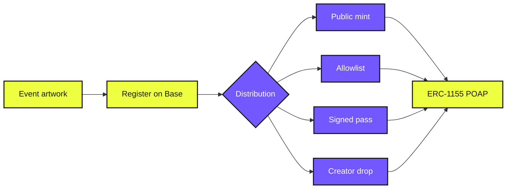
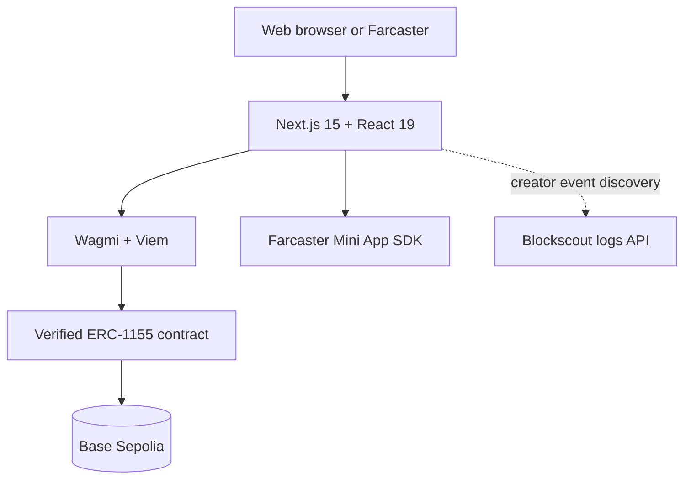

<div align="center">
  <a href="https://poaps.0x94t3z.site">
    
  </a>

  <h1>Onchain POAPs</h1>
  <p>Create, distribute, and collect event credentials stored onchain.</p>

  <p>
    <a href="https://poaps.0x94t3z.site"><strong>Launch studio</strong></a> ·
    <a href="https://farcaster.xyz/miniapps/7hCH6s_9iSJh/onchain-poaps">Open Mini App</a> ·
    <a href="https://poaps.0x94t3z.site/explore">Explore POAPs</a> ·
    <a href="https://poaps.0x94t3z.site/docs">Docs</a>
  </p>

  <p>
    <a href="./LICENSE"></a>
    
    
    
    
  </p>
</div>

## From event to wallet

| Design | Register | Distribute | Collect |
| :---: | :---: | :---: | :---: |
| Build or upload an SVG | Store it directly on Base | Choose the right mint route | Keep verifiable proof |



## Built around the contract

| Onchain artwork | Four mint routes | Creator controls | Wallet collection |
| --- | --- | --- | --- |
| Self-contained SVG and event metadata | Public, allowlist, signed pass, and batch drop | Public-mint status, Merkle root, QR passes | Browse collected POAPs and created events |

The supplied verified contract remains the source of truth. The app does not modify, proxy, or wrap it.
The frontend calls the supplied methods directly: `registerEvent`, `mint`, `allowlistMint`, `mintWithSignature`, `creatorMint`, `updateAllowlistRoot`, and `updateEventPublic`.

## Live proof

| Workflow | Status | Onchain record |
| --- | :---: | --- |
| Register event #7 | Confirmed | [Transaction](https://sepolia.basescan.org/tx/0xac137763b73be0d727f7b2dd5532e757cbbe94ace2c2c254fcf6bc716ea9142f) |
| Public mint and ownership | Confirmed | [Token #7](https://sepolia.basescan.org/token/0xC3249356a483fbe17d5355D39105D2eA666d9de6?a=7) |
| Close public mint | Confirmed | [Transaction](https://sepolia.basescan.org/tx/0x1b73e554712fabed4d89e063c3370066bc36118ab49cd46896ffb4cd9611bd88) |
| Reopen public mint | Confirmed | [Transaction](https://sepolia.basescan.org/tx/0x288d1d865ed8d017e2ab8bd5c1991ac0c818649e8fed2676adb1569f6eb458f2) |
| Creator drop | Confirmed | [Transaction](https://sepolia.basescan.org/tx/0x27718c6f6637ee7c7e94f20154fbbfac352f29df002bbede6dc3bdfad82f626b) |
| Set allowlist root | Confirmed | [Transaction](https://sepolia.basescan.org/tx/0xbeab4be9f094a04e0a8a16e68f757d68a9f3f20dd9003867e4d70e9e4d22f9bb) |
| Allowlist mint | Confirmed | [Transaction](https://sepolia.basescan.org/tx/0x50862fc6a3025a0c26bf07a27730a799b4a3e372dfef0eaed317c02eb041883b) |
| Signed-pass mint | Confirmed | [Transaction](https://sepolia.basescan.org/tx/0x96491eedf018c7935b5a1def6389ee5bbde95799e11dbd6e8f1f0fa22f844c2a) |

<p>
  <a href="https://sepolia.basescan.org/address/0xC3249356a483fbe17d5355D39105D2eA666d9de6#code"><strong>Verified contract ↗</strong></a> ·
  <a href="https://poaps.0x94t3z.site/event/7">Event #7 ↗</a> ·
  <a href="https://farcaster.xyz/0x94t3z.eth/0x4dd9ea63">Launch cast ↗</a>
</p>

## Product map

| Route | Purpose |
| --- | --- |
| [`/create`](https://poaps.0x94t3z.site/create) | Artwork studio and registration |
| [`/explore`](https://poaps.0x94t3z.site/explore) | Searchable onchain events |
| `/event/[id]` | Event details and mint routes |
| `/manage/[id]` | Creator drops, allowlists, passes, and QR codes |
| [`/gallery`](https://poaps.0x94t3z.site/gallery) | Searchable Collected and Created views for the connected wallet |

## Architecture



Collected ownership, event details, and metadata are read from the contract. The Created view uses Blockscout only to discover matching `NewEvent` logs, then verifies event data against the contract. Indexer outages remain retryable and do not affect onchain records.

No custody layer. No application database. No server-held signing key.

## Run locally

```bash
git clone https://github.com/0x94t3z/onchain-poaps-studio.git
cd onchain-poaps-studio
cp .env.example .env.local
npm install
npm run dev
```

Open [localhost:3000](http://localhost:3000). Reads work without a wallet; writes require Base Sepolia test ETH.

```env
NEXT_PUBLIC_APP_URL=http://localhost:3000
NEXT_PUBLIC_CONTRACT_ADDRESS=0xC3249356a483fbe17d5355D39105D2eA666d9de6
NEXT_PUBLIC_RPC_URL=https://sepolia.base.org
NEXT_PUBLIC_WALLETCONNECT_PROJECT_ID=
FARCASTER_HEADER=
FARCASTER_PAYLOAD=
FARCASTER_SIGNATURE=
```

## Configuration notes

- `NEXT_PUBLIC_APP_URL` must match the final HTTPS origin exactly.
- `NEXT_PUBLIC_RPC_URL` should use a dedicated provider for production traffic.
- A [WalletConnect project ID](https://dashboard.walletconnect.com/) enables the external-wallet chooser.
- `FARCASTER_HEADER`, `FARCASTER_PAYLOAD`, and `FARCASTER_SIGNATURE` populate `/.well-known/farcaster.json` for Mini App domain/account association.
- Never place a private key, seed phrase, or server secret in a `NEXT_PUBLIC_` variable.

## Protocol rules

- One event token per wallet across all mint methods.
- Artwork, metadata, and the soulbound setting are immutable after registration.
- Creator controls remain available for 30 days; signed passes remain valid for 37 days.
- A non-zero allowlist root can be set only once.
- Soulbound tokens cannot be transferred.

## Cryptographic compatibility

Signed pass:

```text
keccak256(abi.encodePacked(eventId, chainId, recipient))
```

Allowlist leaf:

```text
keccak256(abi.encodePacked(address))
```

Leaves and node pairs are sorted lexicographically. Addresses are checksummed and deduplicated before export.

## Validate

```bash
npm run typecheck
npm test
npm run build
```

## License

[MIT](./LICENSE) · Contract maintained separately in [`jvaleskadevs/onchain-poaps`](https://github.com/jvaleskadevs/onchain-poaps).
